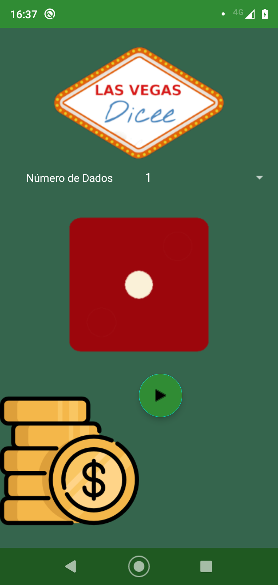
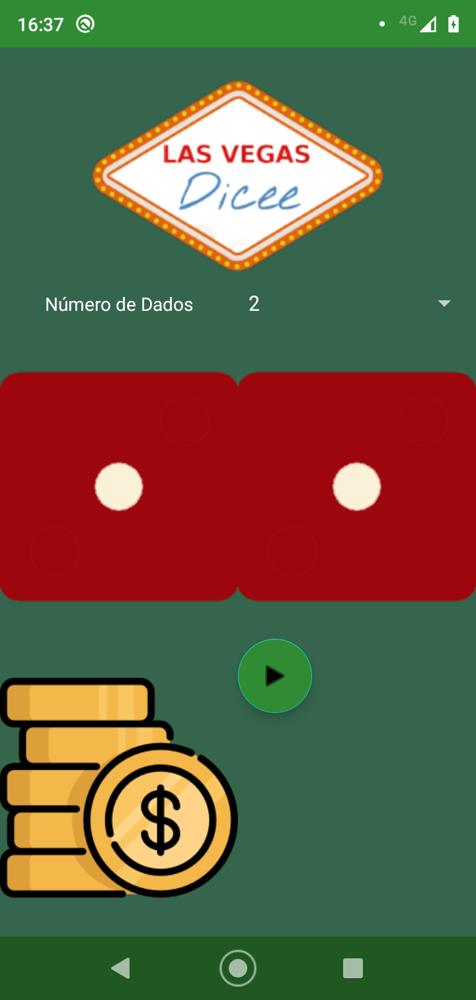

# TheDiceGame

🎲 A roll dices games 🎰

## Introduction ##

 

Note: In the prints the texts are in pt-br, but the app support en-US too.

This is a very simple app, is only for roll dice numbers, if you play any kind of game that needs dice, you can
have in thus app your virtual dices. You don't need anymore to worry if you lost or forgot your dices, your game
will not be lost!
The app support to choose how many dices(1 or 2) you wanna use, this because some games needs only one.

